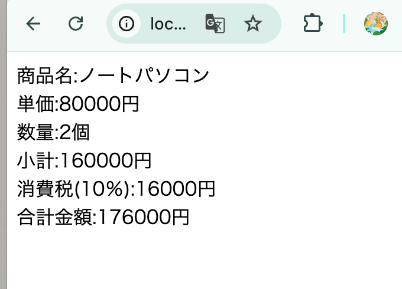

# php-basics-practice

## 概要
COACHTECH 教材 Tutorial 7-1「PHPの基礎 ハンズオン演習」で作成した成果物です。
（**ここに、
何を作ったかを1〜2行で書きましょう**）
ノートパソコンを商品とした、消費税などを含む合計金額の計算処理と画面出力を実装しました。

## 使用技術
- PHP 8.x
（**他に使ったものがあれば追記してください**）

## 学んだこと
- （**自分の言葉で2〜3項目書きましょう**）
- 計算処理の終わった変数を実際に文字列へ埋め込み表示できる形へ作成した
- コメント欄などを使用し、何の計算であるかわかりやすく作成した
- 改行"( )"の文字列への埋め込み方を学べた

## 動作確認
（**どうやって動かして確認するかを記載してください**）
ローカルサーバー 'http://localhost:8000/7-1-6_hands-on/practice/price_calculator.php' にアクセスして画面を表示します。
